# Pixel Cross - Tienda de Videojuegos y Coleccionables

Proyecto web responsivo desarrollado con **HTML5, CSS3, Bootstrap 5 y JavaScript (ES6+)**. Implementa carga dinámica de productos mediante **Fetch API**, manipulación directa del **DOM** para la gestión de un carrito de compras interactivo con **LocalStorage**, y validación con feedback visual en el formulario de contacto.

---

## Funcionalidades Principales

* **Carga Asíncrona (Fetch API):** Obtención dinámica del catálogo desde un archivo `JSON` externo.
* **Diseño Responsivo:** Adaptación completa a dispositivos móviles, tablets y computadoras utilizando la grilla de **Bootstrap 5**.
* **Carrito de Compras Interactivo:**
  * Contador dinámico de ítems en el Navbar.
  * Cálculo automático del total a pagar.
  * Modificación de cantidades, eliminación individual y vaciado del carrito.
  * Persistencia de datos mediante `localStorage`.
* **Filtrado y Buscador Dinámico:** Filtrado inmediato por categorías (Videojuegos, TCG, Accesorios) y búsqueda por texto en tiempo real.
* **Formulario de Contacto:** Gestión de eventos `submit` con mensajes interactivos de alerta.

---

## Tecnologías Utilizadas

* **HTML5:** Estructuración semántica de las distintas páginas.
* **CSS3 / Bootstrap 5:** Maquetación responsiva, componentes visuales y utilidades.
* **JavaScript (ES6+):** Programación modular, manipulación del DOM y manejo de eventos.
* **Fetch API:** Consumo de datos externos.
* **LocalStorage:** Almacenamiento persistente del estado del carrito en el navegador.

---

## Evidencias de Funcionamiento y Adaptabilidad

### Vista Escritorio (Desktop)

#### 1. Página de Inicio y Catálogo General
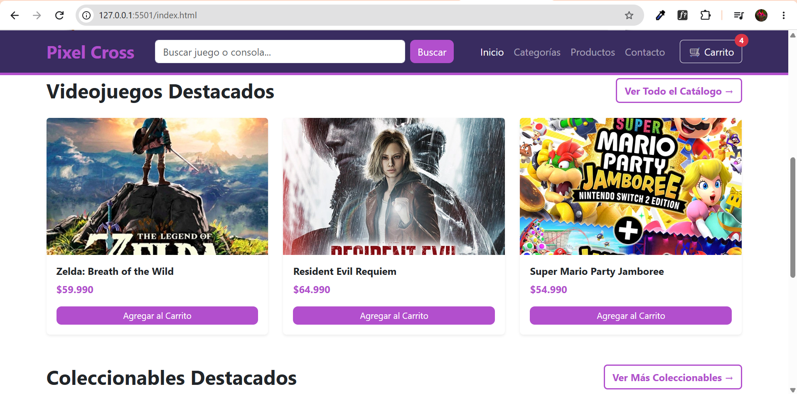
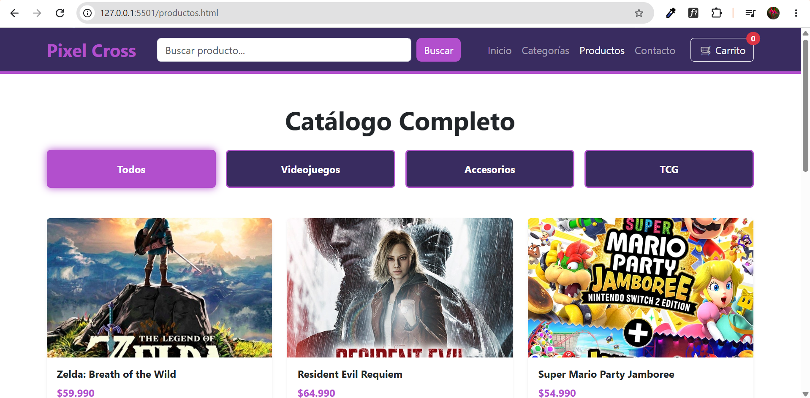

#### 2. Filtro por Categorías y Buscador
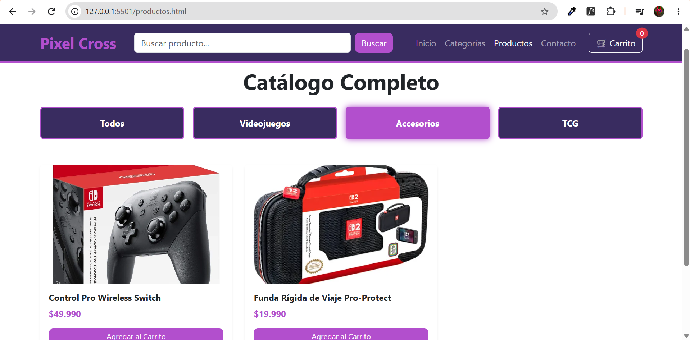
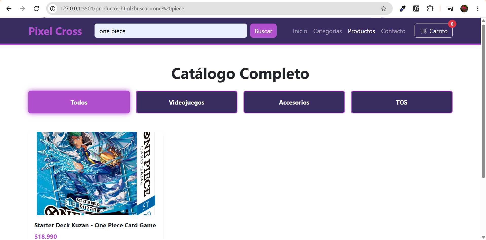

#### 3. Carrito de Compras (Vacío y Lleno)
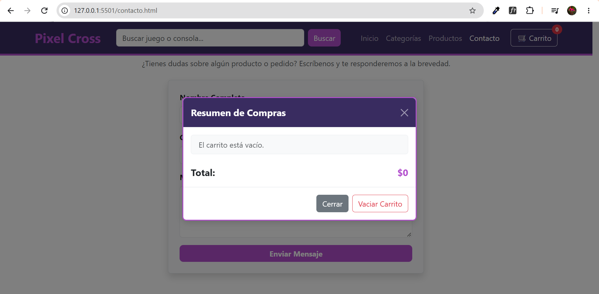
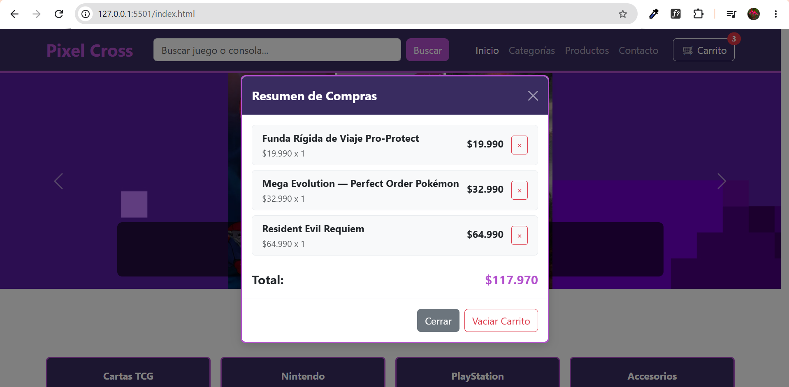

#### 4. Formulario de Contacto y Feedback
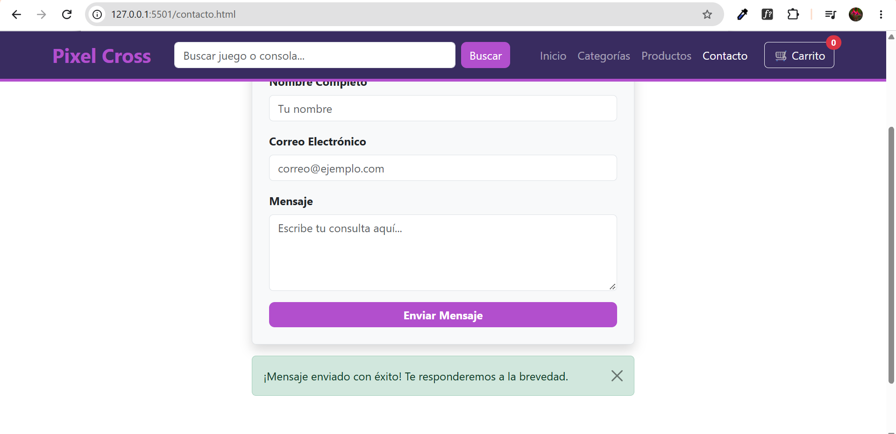

---

### Vista Móvil (Mobile)

#### 1. Navegación e Inicio
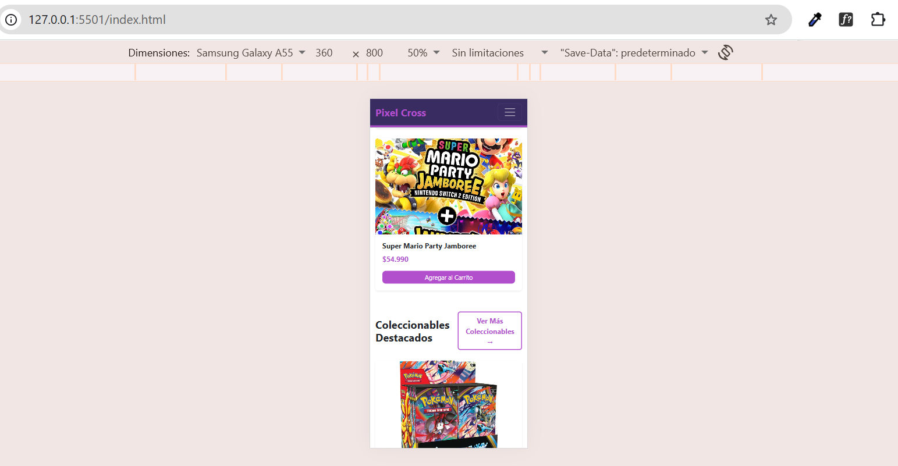

#### 2. Filtro de Categorías y Buscador
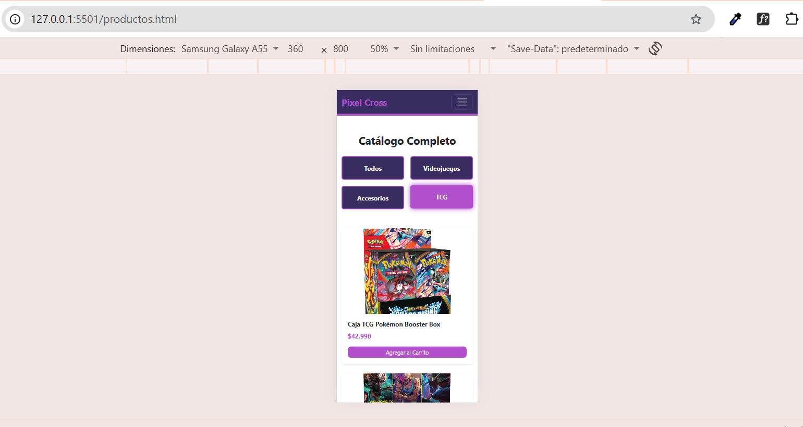
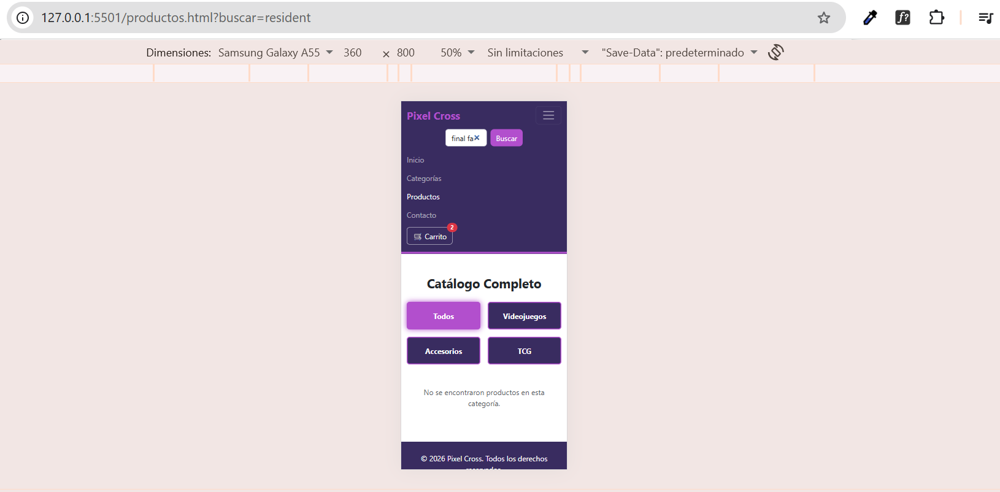

#### 3. Carrito de Compras y Contacto
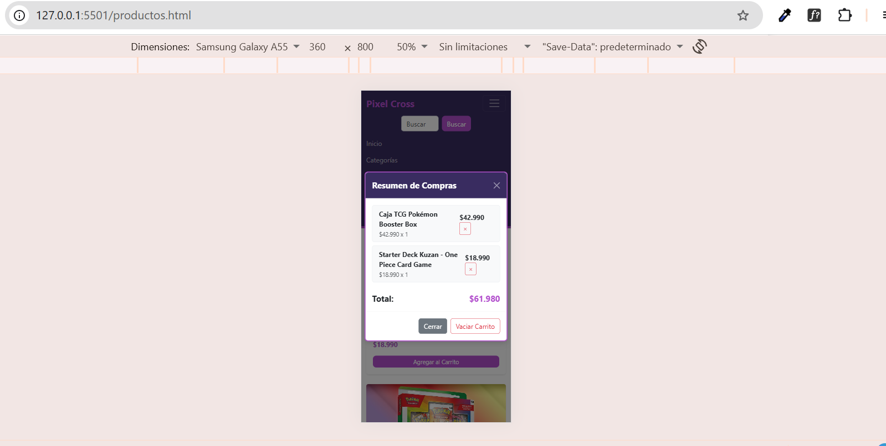
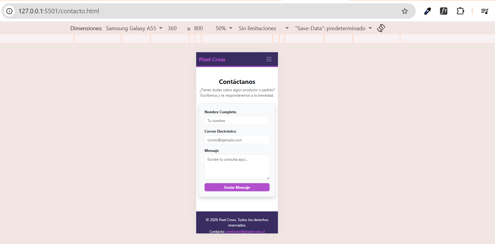

---

## Despliegue

El proyecto se encuentra alojado y disponible en **GitHub Pages**:
`https://KatherineIbanezL.github.io/DESARROLLO-FRONTEND-I/`